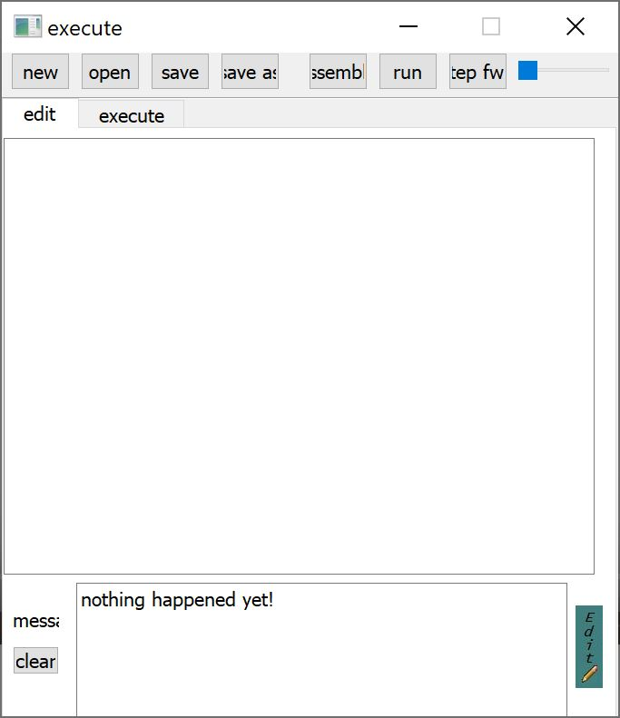
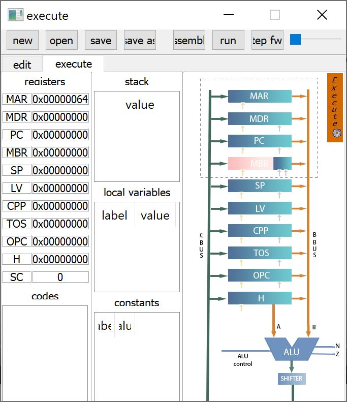

# IJVM_emulator
a new emulator for IJVM 

you can add your code in IJVM assembely in the text box in edit tab.
your code should contains .vars, .text, and .consts part.

after writing your code you should save it and then click on save button.
now you can assemble your code by clicking on assemble button.

after that you would directed to execute tab and execute your code step by step or all at once by in order clicking on step forward and run button.

in execute tab you would be able to see registers values, stack, variabels, executing instructions, and whats going on CPU architecture.
